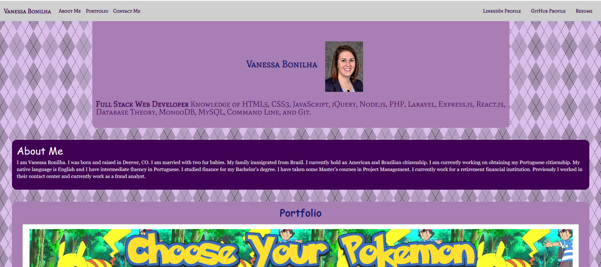

This webpage is the location for the professional portfolio for Vanessa Bonilha. This webpage will contain information 
about Vanessa Bonilha. It will also contain links to various projects that Vanessa has completed. A method to contact Vanessa 
is also incorporated into the webpage. 

Challenges for this website include formatting the html with the css. Successes include integrating future projects into the webpage. 

About Vanessa: "I am Vanessa Bonilha. I was born and raised in Denver, CO. I am married with two fur babies. My family
        immigrated from Brazil. I currently hold an American and Brazilian citizenship. I am currently working on
        obtaining my Portuguese citizenship. My native language is English and I have
        intermediate fluency in Portuguese. I studied finance for my Bachelor's degree. I have taken some Master's
        courses in Project Management. I currently work for a retirement financial institution. Previously I worked 
        in their contact center and currently work as a fraud analyst."

Vanessa's Projects:

        - Choose Your Pokemon(project)
        - Password Generator
        - Zelda Game Quiz
        - Day Planner
        - What's the Weather 

A form input is being used for individuals to contact Vanessa.

